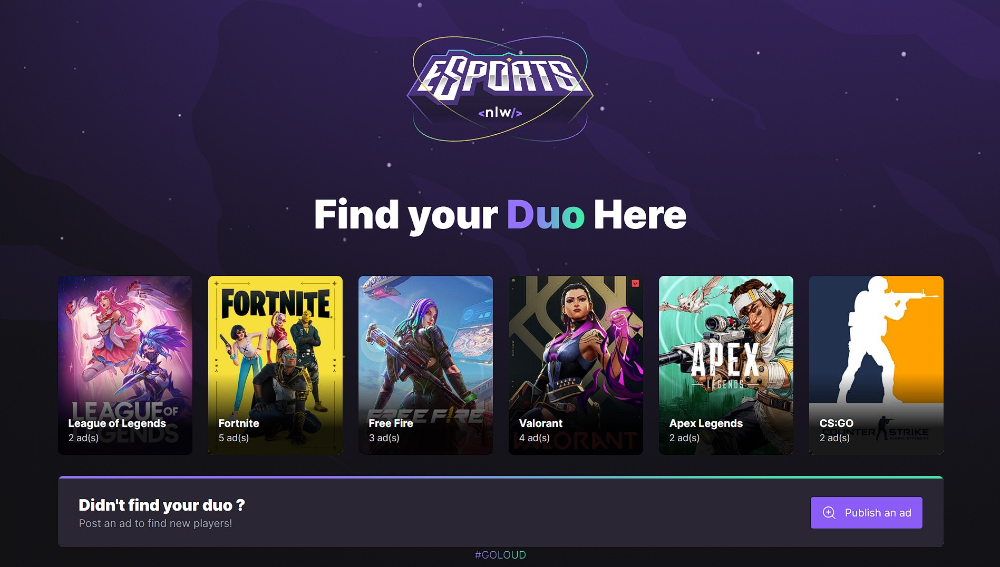

<h1 align="center">
  eSports Duo
 </h1>
  

  
  
  
   
  <a href="#-project">Project</a>&nbsp;&nbsp;&nbsp;|&nbsp;&nbsp;&nbsp;
  <a href="#-tech">Techs</a>&nbsp;&nbsp;&nbsp;|&nbsp;&nbsp;&nbsp;
  <a href="#-rocketseat">Rocketseat</a>&nbsp;&nbsp;&nbsp;|&nbsp;&nbsp;&nbsp;
  <a href="#-layout"> Layout </a>&nbsp;&nbsp;&nbsp;|&nbsp;&nbsp;&nbsp;
  <a href="#-considerations"> Considerations </a>&nbsp;&nbsp;&nbsp;|&nbsp;&nbsp;&nbsp;
  

 

## 💻 Project
eSport Duo is an application focused on joining two players according to the selected game

## 🚀 Tech
This fullstack project was developed with the following techs:

- Vite
- React / React Native with Typescript
- TailwindCSS
- NodeJS
- Prisma 
- Express

## 🎓 Rocketseat
 We have created a dedicated environment so that programmers and programmers can connect with opportunities, study and grow in careers through a complete and continuous learning journey.
 
 ## 🎨 Layout
 You can view the project layout through [This Link](https://www.figma.com/community/file/1120711251998877938). It's necessary to have a account on [Figma](http://figma.com/) to view it.
 
 ## ♥ Considerations 
 Rocketseat is responsible for this project, without its classes that would never be possible. Thank you Rocketseat ♥
